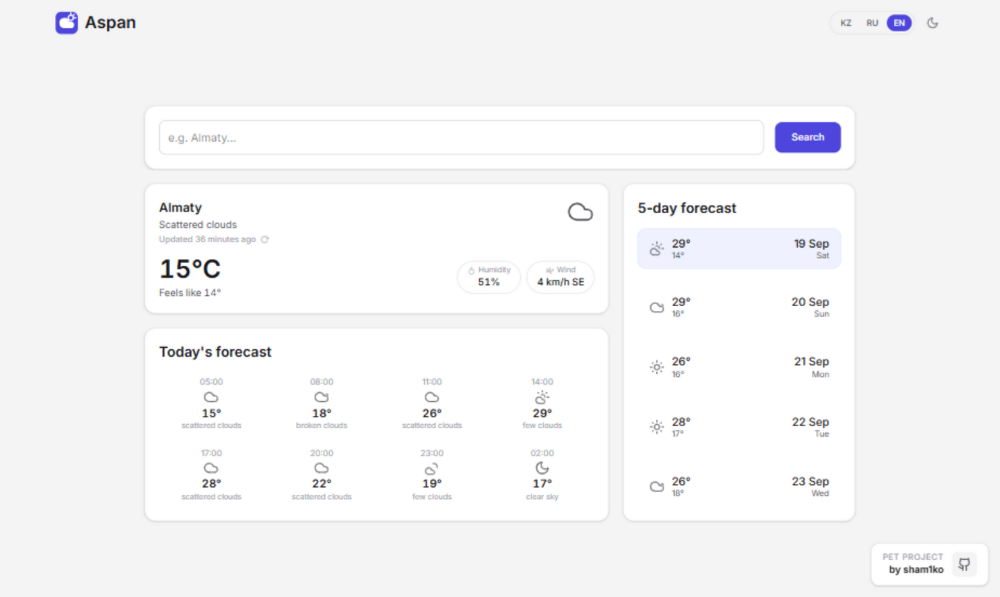

<div align="center">


# Aspan

*Kazakh for "sky"*

**A weather app: current conditions, hourly and 5-day forecast**

**English** | [Русский](README.ru.md)

[](https://nextjs.org/)
[](https://react.dev/)
[](https://www.typescriptlang.org/)
[](https://tailwindcss.com/)
[](https://redis.io/)

[](#)
[](#)
[](#)

<picture>
  <source media="(prefers-color-scheme: dark)" srcset="docs/screenshot-dark.png">
  
</picture>

</div>

## Features

- **Current weather**, a 24-hour hourly forecast and a 5-day forecast
- **Automatic geolocation** — until the first search you see the weather for your city (Vercel geolocation)
- **Three languages** — Kazakh, Russian and English; weather descriptions are localized too, with a custom condition dictionary for Kazakh
- **Times and dates in the city's timezone**, not the viewer's — the hourly grid and day boundaries live where the forecast lives
- **City in the URL** — `?city=Almaty`: shareable links, and the browser's back/forward buttons switch between cities
- **Redis cache** for an hour plus a 7-day emergency cache if OpenWeatherMap goes down
- **Light and dark themes** with a switcher
- Loading skeletons, friendly errors with hints and a retry button

## Quick start

```bash
git clone https://github.com/sham1ko/weather-app.git
cd weather-app
pnpm install
cp .env.sample .env   # fill in OPENWEATHERMAP_API_KEY
pnpm dev
```

Open [http://localhost:3000](http://localhost:3000).

### Environment variables

| Variable | Required | Description |
|---|---|---|
| `OPENWEATHERMAP_API_KEY` | yes | Your [OpenWeatherMap](https://openweathermap.org/api) key — the free tier is enough |
| `REDIS_URL` | no | Redis address, defaults to `redis://localhost:6379` |
| `REDIS_ENABLED` | no | `false` / `off` / `0` / `no` — fully disables the cache, every request goes straight to the API |

## Scripts

| Command | Action |
|---|---|
| `pnpm dev` | Start in development mode |
| `pnpm build` | Production build |
| `pnpm start` | Run the built app |
| `pnpm lint` | ESLint |

## How it works

- **OpenWeatherMap** — `/weather` and `/forecast` endpoints; description language follows the interface language (Kazakh uses a custom condition dictionary built on weather codes)
- **Redis** — responses are cached for an hour with a 7-day "stale" copy: if OpenWeatherMap goes down, the app serves outdated data and honestly shows its age
- **URL as state** — a search writes the city into the address (`pushState`), so back/forward and shared links work without a page reload
- **Dependency-free i18n** — typed dictionaries (`ru` is the type source for `kk`/`en`), `useSyncExternalStore` over `localStorage`, `Intl` for dates and plurals
- Forecast dates and hours are rendered in the **city's timezone** (`city.timezone` from the API response); the "updated N minutes ago" label uses the viewer's

## Author

[sham1ko](https://github.com/sham1ko) · Shamshyrak Zholdasbek
